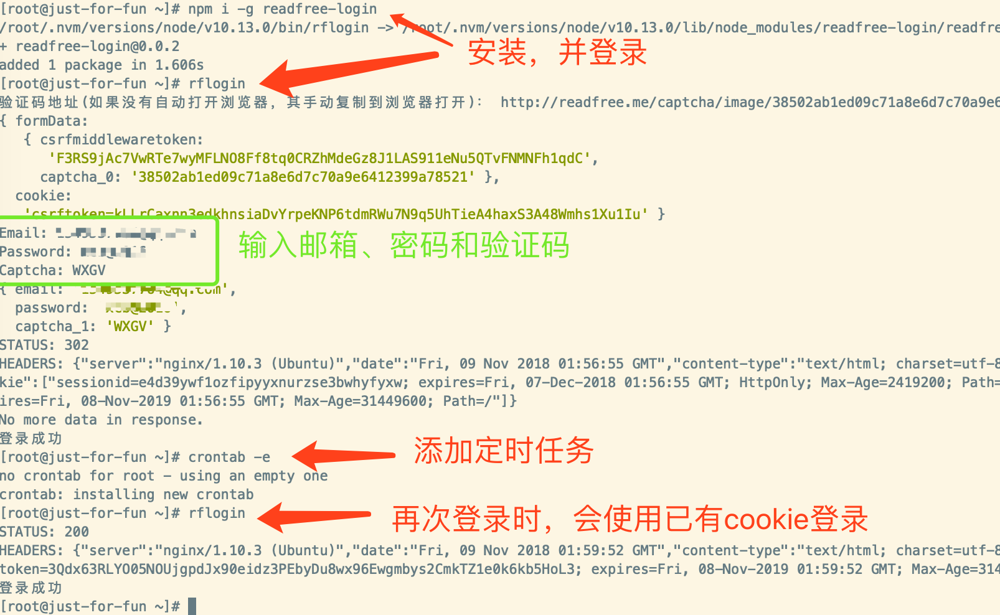

命令行登录[http://readfree.me](http://readfree.me), 领签到币的目的。;

# 使用
1. 安装命令行
```sh
npm i readfree-login
```

2. 初始化登录, 命令执行，然后按照提示输入用户名、密码和验证码
```sh
rflogin
```

3. 登录之后会将登录信息保存在本地`__dirname + 'cookie.txt'`文件中

4. 支持手动修改cookie, 设置cookie时需要拼接好：
```
// 在网站登录readfree.me后，获取cookie中的 csrftoken和sessionid两个cookie值
// eg: csrftoken=aTAMwQnLJbsMLyMCZK1gASzh1gMMJtxMQSov8MMRoF8OyUD3lUaaYivZWO4EfZrj;sessionid=v90rxcxvj7u6xip97jp5eqqi4gw9sblv
// 该cookie已经被修改过，示例使用
rflogin --cookie="csrftoken=aTAMwQnLJbsMLyMCZK1gASzh1gMMJtxMQSov8MMRoF8OyUD3lUaaYivZWO4EfZrj;sessionid=v90rxcxvj7u6xip97jp5eqqi4gw9sblv"
```


5. 执行crontab -e进行编辑，crontab 的格式可以参考 crontab 定时任务:
```sh
#每天8：30执行一次rflogin这个命令
30 8 * * * rflogin
```
如果node是使用`nvm`安装的，还需要指定其路径，不然会提示找不到命令，像我就是：
```sh
# export PATH=/root/.nvm/versions/node/v10.13.0/bin:$PATH; 添加node的路径到环境变量中
# >> /var/log/rflogin.log 将命令输出的东西重定向到rflogin.log文件，默认被重定向到/dev/null中，也就忽视
# 2>&1 表示包含标准输出&错误，默认只重定向标准输出
30 8 * * * export PATH=/root/.nvm/versions/node/v10.13.0/bin:$PATH; rflogin >> /var/log/rflogin.log 2>&1
```

5. 一般是一个月会过期一次，如果过期了，请重新执行：
```sh
rflogin
```

示意图：

